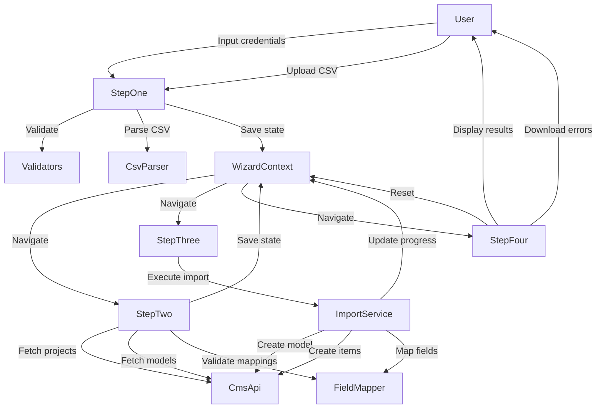

# Component Dependencies & Data Flow

## Application Data Flow

### Overall Wizard Flow

```
[User] → [StepOne] → [WizardContext] → [StepTwo] → [WizardContext] → [StepThree] → [WizardContext] → [StepFour]
           ↓                              ↓                              ↓
      [CsvParser]                    [CmsApi]                      [ImportService]
                                          ↓                              ↓
                                    [FieldMapper]                  [CmsApi + FieldMapper]
```

---

## Step-by-Step Data Flow

### Step 1: Welcome & Setup

**User Actions** → **Component** → **Service** → **Context**

```
1. User enters API key, workspace ID, base URL
   ↓
   StepOne (CredentialsForm)
   ↓
   Validators.validateApiKey/validateWorkspaceId
   ↓
   WizardContext.updateCredentials()
   ↓
   Storage.saveCredentials()

2. User uploads CSV file
   ↓
   StepOne (FileUpload)
   ↓
   WizardContext.setCsvFile()
   ↓
   CsvParser.parseFile()
   ↓
   WizardContext.setCsvData()

3. User clicks "Next"
   ↓
   WizardContext.nextStep() → Step 2
```

**Data Stored in Context**:
- `credentials` { apiKey, workspaceId, baseUrl }
- `csvFile` File object
- `csvData` { headers, fields, rows, rowCount }

---

### Step 2: Configure Import

**Component** → **Service** → **API** → **Context**

```
Phase 1: Load Projects
   StepTwo (mount)
   ↓
   CmsApi.initialize(credentials)
   ↓
   CmsApi.fetchProjects()
   ↓
   Display projects in dropdown

Phase 2: User selects project
   StepTwo (ProjectSelector)
   ↓
   WizardContext.setSelectedProject(project)

Phase 3: User selects import mode
   StepTwo (ImportModeToggle)
   ↓
   WizardContext.setImportMode('createNew' | 'existing')

Phase 4a: Create New Model path
   StepTwo (CreateNewModelForm)
   ↓
   User configures model name, key, fields
   ↓
   Validators.validateModelKey()
   ↓
   WizardContext.setNewModelConfig(config)

Phase 4b: Import to Existing path
   StepTwo (mount with mode='existing')
   ↓
   CmsApi.fetchModels(projectId)
   ↓
   Display models in dropdown
   ↓
   User selects model
   ↓
   CmsApi.fetchModel(modelId) // get schema
   ↓
   WizardContext.setSelectedModel(model)
   ↓
   User maps CSV fields to model fields
   ↓
   FieldMapper.validateMappings(csvData, mappings, model.schema.fields)
   ↓
   WizardContext.setFieldMappings(mappings)

Phase 5: User clicks "Import"
   ↓
   WizardContext.nextStep() → Step 3
```

**Data Stored in Context**:
- `selectedProject` Project object
- `importMode` 'createNew' | 'existing'
- `newModelConfig` NewModelConfig (if createNew) OR
- `selectedModel` Model + schema (if existing)
- `fieldMappings` FieldMapping[]

---

### Step 3: Import Process

**Component** → **Service** → **API** → **Context**

```
Step Three (mount)
   ↓
   if (importMode === 'createNew') {
     ImportService.executeCreateNewImport(
       projectId,
       newModelConfig,
       csvData,
       onProgress
     )
       ↓
       Phase 1: Create Model
         ↓
         CmsApi.createModel(projectId, { name, key, description })
         ↓
         Get schemaId from response
         ↓
         CmsApi.createFields(projectId, schemaId, fieldsConfig)
         ↓
         WizardContext.updateImportProgress({ phase: 'creatingModel', message: '...' })

       Phase 2: Import Data
         ↓
         for each CSV row:
           FieldMapper.mapRowToFields(row, fieldMappings)
           ↓
           CmsApi.createItem(modelId, fields)
           ↓
           WizardContext.updateImportProgress({ processedRows: i, message: '...' })
         ↓
         Aggregate results (success count, errors)
         ↓
         WizardContext.setImportResults(results)
   }

   else if (importMode === 'existing') {
     ImportService.executeExistingModelImport(
       modelId,
       fieldMappings,
       csvData,
       onProgress
     )
       ↓
       for each CSV row:
         FieldMapper.mapRowToFields(row, fieldMappings)
         ↓
         CmsApi.createItem(modelId, fields)
         ↓
         WizardContext.updateImportProgress({ processedRows: i, message: '...' })
       ↓
       Aggregate results
       ↓
       WizardContext.setImportResults(results)
   }

   When import complete:
     ↓
     WizardContext.nextStep() → Step 4
```

**Data Stored in Context**:
- `importProgress` { phase, totalRows, processedRows, successCount, errorCount, currentMessage }
- `importResults` { success, totalRows, successCount, errorCount, errors[] }

---

### Step 4: Results

**Component** → **Context** → **User Actions**

```
StepFour (mount)
   ↓
   Read WizardContext.state.importResults
   ↓
   Display summary (success icon or error icon)
   ↓
   Display statistics (total, success, error counts)
   ↓
   if (errors.length > 0) {
     Display ErrorTable with error details
   }

User Actions:
   1. Download Error Report
      ↓
      Generate CSV with failed rows + error messages
      ↓
      Trigger browser download

   2. Import Another CSV
      ↓
      WizardContext.reset()
      ↓
      WizardContext.goToStep(1)

   3. View in Re:Earth CMS
      ↓
      window.open(cmsUrl) // if URL available
```

**Data Read from Context**:
- `importResults` { success, totalRows, successCount, errorCount, errors[] }

---

## Component Dependency Matrix

### Components → Services

| Component | CsvParser | CmsApi | FieldMapper | ImportService | Validators | Storage |
|-----------|-----------|--------|-------------|---------------|------------|---------|
| WizardProvider | ❌ | ❌ | ❌ | ❌ | ❌ | ✅ |
| StepOne | ✅ | ❌ | ❌ | ❌ | ✅ | ❌ |
| StepTwo | ❌ | ✅ | ✅ | ❌ | ✅ | ❌ |
| StepThree | ❌ | ❌ | ❌ | ✅ | ❌ | ❌ |
| StepFour | ❌ | ❌ | ❌ | ❌ | ❌ | ❌ |

### Services → Services

| Service | CsvParser | CmsApi | FieldMapper | Validators |
|---------|-----------|--------|-------------|------------|
| ImportService | ❌ | ✅ | ✅ | ❌ |
| CmsApi | ❌ | — | ❌ | ❌ |
| FieldMapper | ❌ | ❌ | — | ❌ |
| Validators | ❌ | ❌ | ❌ | — |
| CsvParser | — | ❌ | ❌ | ❌ |

**Dependency Observations**:
- No circular dependencies
- Services are independent except ImportService (coordinates CmsApi + FieldMapper)
- Components depend on WizardContext, not directly on each other
- Clear separation of concerns

---

## State Management Architecture

### WizardContext State Shape

```typescript
WizardState {
  // Navigation
  currentStep: 1 | 2 | 3 | 4

  // Step 1 Data
  credentials: {
    apiKey: string
    workspaceId: string
    baseUrl: string
  }
  csvFile: File | null
  csvData: CsvData | null

  // Step 2 Data
  selectedProject: Project | null
  importMode: 'createNew' | 'existing' | null
  newModelConfig: NewModelConfig | null  // for createNew path
  selectedModel: Model | null             // for existing path
  fieldMappings: FieldMapping[]

  // Step 3 Data
  importProgress: ImportProgress | null

  // Step 4 Data
  importResults: ImportResults | null
}
```

### Context Update Patterns

**Atomic Updates** (single field):
```typescript
updateCredentials(credentials: Partial<Credentials>) => void
setCsvFile(file: File) => void
setSelectedProject(project: Project) => void
```

**Batch Updates** (multiple fields):
```typescript
updateImportProgress(progress: Partial<ImportProgress>) => void
```

**Navigation**:
```typescript
goToStep(step: 1 | 2 | 3 | 4) => void
nextStep() => void
previousStep() => void
```

**Reset**:
```typescript
reset() => void  // Clear all state, return to step 1
```

---

## Component Communication Patterns

### Pattern 1: Parent → Child (Props)

```
WizardContainer
    ↓ (props)
StepRouter
    ↓ (props)
StepOne/Two/Three/Four
```

Not heavily used since Context provides most data.

### Pattern 2: Component → Context (State Updates)

```
Component
    ↓ (context method)
WizardContext.updateX()
    ↓ (state change)
Re-render consumers
```

Most common pattern for data flow.

### Pattern 3: Component → Service → Component (Async)

```
Component
    ↓ (async call)
Service (e.g., CmsApi.fetchProjects())
    ↓ (promise resolves)
Component (setState)
    ↓ (render)
UI Update
```

Used for data fetching and processing.

### Pattern 4: Service → Context → Component (Progress Updates)

```
ImportService
    ↓ (onProgress callback)
Component
    ↓ (context method)
WizardContext.updateImportProgress()
    ↓ (state change)
StepThree re-renders with new progress
```

Used for real-time progress tracking.

---

## Error Handling Flow

### Service Error → Component → User

```
Service (throws ServiceError)
    ↓ (caught in try-catch)
Component
    ↓ (sets local error state)
ErrorMessage component
    ↓ (renders)
User sees error message
```

### API Error Flow Example

```
CmsApi.fetchProjects()
    ↓ (API returns 401)
throw new ServiceError('AUTH_ERROR', 'Invalid API credentials')
    ↓
StepTwo (catch)
    ↓
setError('Invalid API credentials. Please check your API key.')
    ↓
<ErrorMessage error={error} />
```

---

## Data Flow Diagram (Mermaid)



---

## Optimization Considerations

### Prevent Unnecessary Re-renders

**Strategy**:
- Use `React.memo()` for expensive components (Table, FieldMappingTable)
- Memoize expensive computations with `useMemo()`
- Memoize callbacks with `useCallback()`

**Example**:
```typescript
const MemoizedFieldMappingTable = React.memo(FieldMappingTable);

// In component:
const handleMappingChange = useCallback((mappings) => {
  setFieldMappings(mappings);
}, []);
```

### Lazy Loading

**Strategy**:
- Lazy load step components with `React.lazy()`
- Only load heavy dependencies (PapaParse) when needed

**Example**:
```typescript
const StepTwo = React.lazy(() => import('./steps/StepTwo'));
const StepThree = React.lazy(() => import('./steps/StepThree'));
```

### Web Worker for CSV Parsing

**Strategy**:
- Offload CSV parsing to Web Worker
- Keep main thread responsive during large file processing

**Flow**:
```
StepOne
    ↓
CsvParser.parseFile()
    ↓
Initialize Web Worker
    ↓
Worker: PapaParse.parse()
    ↓
postMessage(result) back to main thread
    ↓
CsvParser receives result
    ↓
Return to StepOne
```

---

## Summary

**Key Architectural Patterns**:
1. **Unidirectional Data Flow**: User → Component → Service → Context → Component
2. **Context for State**: WizardContext as single source of truth
3. **Service Layer**: Business logic isolated from UI
4. **Async Operations**: Services handle all async work (API, parsing)
5. **Error Boundaries**: Consistent error handling across all layers

**Dependencies**:
- No circular dependencies
- Clear separation between UI (components) and logic (services)
- Context acts as state hub, avoiding prop drilling
- Services are composable and testable

This architecture supports maintainability, testability, and scalability while keeping the codebase simple and focused.
