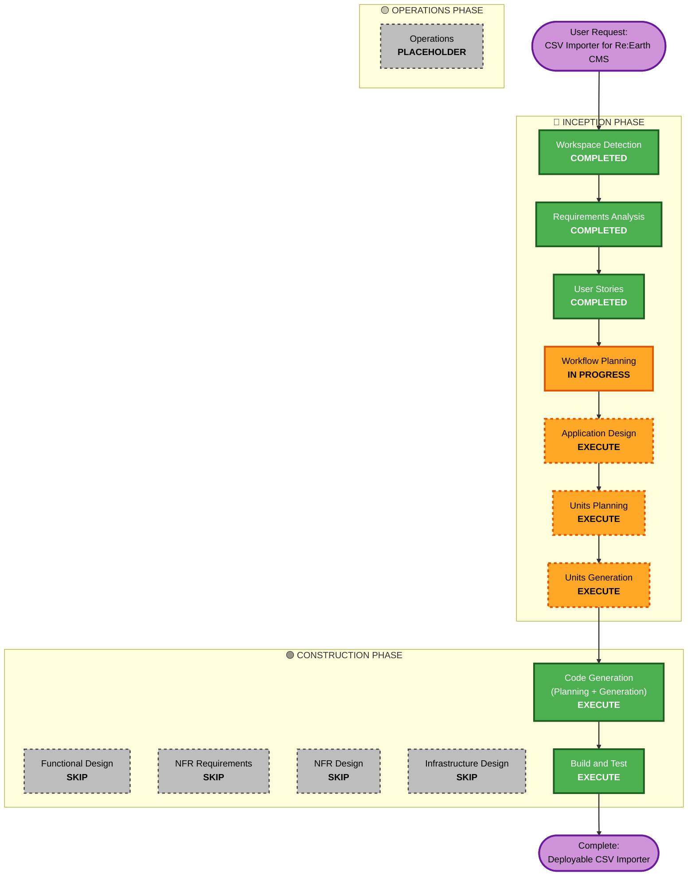

# Execution Plan - Re:Earth CMS CSV Importer

## Project Context

**Project Type**: Greenfield (new application from scratch)
**Scope**: Single-page React application for CSV import to Re:Earth CMS
**Complexity**: Moderate (4-step wizard, dual-path workflow, API integration)

---

## Detailed Analysis Summary

### Project Classification
- **Type**: Greenfield - no existing codebase
- **Primary Changes**: Complete new application development
- **Related Components**: None (standalone application)

### Change Impact Assessment

**User-facing changes**: Yes - Complete new user interface
- 4-step wizard workflow
- CSV file upload and analysis
- Field mapping configuration
- Real-time import progress
- Results and error reporting

**Structural changes**: N/A - New architecture being created
- React 19+ with Vite build tool
- Component-based architecture
- Service layer for API integration
- Web Workers for CSV processing

**Data model changes**: N/A - No database
- In-memory CSV data processing
- SessionStorage for temporary credentials
- No persistent storage

**API changes**: N/A - Consuming existing Re:Earth CMS API
- Using @reearth/cms-api SDK
- No custom API being created

**NFR impact**: Yes - Performance, security, usability requirements
- Web Workers for non-blocking CSV parsing (up to 50K rows)
- Client-side rate limiting for API calls (5-10 req/sec)
- Security: input validation, XSS prevention, secure credential storage
- Usability: 4-step wizard, clear error messaging

### Risk Assessment
- **Risk Level**: Low to Medium
- **Rationale**:
  - Greenfield project with clear requirements
  - Well-defined user stories and acceptance criteria
  - Using official SDK reduces integration risk
  - Frontend-only architecture simplifies deployment
  - Moderate complexity due to dual-path workflow
- **Rollback Complexity**: Easy (static site deployment, no database migrations)
- **Testing Complexity**: Moderate (CSV parsing edge cases, API integration testing, dual workflow paths)

---

## Workflow Visualization

---

## Phases to Execute

### 🔵 INCEPTION PHASE

- [x] **Workspace Detection** - COMPLETED
  - Confirmed greenfield project
  - Empty workspace detected
  - AI-DLC workflow initialized

- [x] **Requirements Analysis** - COMPLETED
  - Functional requirements (FR-01 to FR-07) defined
  - Non-functional requirements documented
  - Technical stack selected (React 19 + Vite + Tailwind + @reearth/cms-api)
  - 4-step UI/UX structure defined
  - API integration verified and SDK selected

- [x] **User Stories** - COMPLETED
  - 13 user stories generated
  - Simple "User" persona created
  - Stories organized by 4-step wizard workflow
  - Acceptance criteria defined for each story

- [x] **Workflow Planning** - IN PROGRESS
  - Creating execution plan
  - Determining which phases to execute

- [ ] **Application Design** - EXECUTE
  - **Rationale**: New application requires architectural design
  - **Deliverables**:
    - Component hierarchy and structure
    - Folder organization (React components, services, utilities, types)
    - State management approach
    - React component diagram
    - Service layer design (CSV parser, API client, validators)
    - Routing/navigation structure (if needed for step wizard)
    - Data flow diagrams

- [ ] **Units Planning** - EXECUTE
  - **Rationale**: Need to plan implementation units for systematic development
  - **Deliverables**:
    - Break down application design into implementation units
    - Define unit order and dependencies
    - Identify reusable components and utilities
    - Plan test strategy per unit
    - Unit checklist for code generation phase

- [ ] **Units Generation** - EXECUTE
  - **Rationale**: Generate detailed design docs for each implementation unit
  - **Deliverables**:
    - Design doc for each unit (components, services, utilities)
    - Interface definitions and type specifications
    - Component props and state design
    - Service method signatures
    - Unit testing requirements

### 🟢 CONSTRUCTION PHASE

- [ ] **Functional Design** - SKIP
  - **Rationale**: User stories and application design provide sufficient functional detail. The 4-step wizard workflow is well-defined with clear acceptance criteria.

- [ ] **NFR Requirements** - SKIP
  - **Rationale**: NFR requirements already captured in requirements.md (performance, security, usability, reliability). No additional NFR assessment needed.

- [ ] **NFR Design** - SKIP
  - **Rationale**: NFR implementation approaches already defined:
    - Performance: Web Workers for CSV parsing, client-side throttling
    - Security: Input validation, XSS prevention, sessionStorage for credentials
    - Usability: 4-step wizard, clear error messaging
    - Reliability: Error handling, partial import support

- [ ] **Infrastructure Design** - SKIP
  - **Rationale**: Static site deployment (Vercel/Netlify) requires no infrastructure design. No servers, databases, or cloud resources to architect.

- [ ] **Code Generation** - EXECUTE (ALWAYS)
  - **Rationale**: Implementation planning and code generation needed for all units
  - **Deliverables**:
    - Planning: Implementation plan for each unit
    - Generation: React components, services, utilities, types
    - Tests: Unit tests and integration tests
    - Configuration: Vite config, Tailwind config, TypeScript config

- [ ] **Build and Test** - EXECUTE (ALWAYS)
  - **Rationale**: Build, test, and verification needed
  - **Deliverables**:
    - Project build succeeds
    - All tests pass
    - Linting and type checking pass
    - Manual verification of user stories
    - Deployment to staging environment

### 🟡 OPERATIONS PHASE

- [ ] **Operations** - PLACEHOLDER
  - **Rationale**: Future deployment and monitoring workflows not yet defined in AI-DLC

---

## Execution Sequence

The workflow will proceed in this order:

1. ✅ **Workspace Detection** → Completed
2. ✅ **Requirements Analysis** → Completed
3. ✅ **User Stories** → Completed
4. ⏳ **Workflow Planning** → In Progress
5. ⏭️ **Application Design** → Next
6. ⏭️ **Units Planning** → After Application Design
7. ⏭️ **Units Generation** → After Units Planning
8. ⏭️ **Code Generation** → After Units Generation
9. ⏭️ **Build and Test** → Final step

**Total Phases to Execute**: 9 (4 completed, 1 in progress, 4 pending)

---

## Success Criteria

### Primary Goal
Build a fully functional CSV importer for Re:Earth CMS that allows users to:
- Upload CSV files
- Choose between creating new models or importing to existing models
- Map fields with type compatibility checking
- Monitor import progress in real-time
- View detailed results with error reporting

### Key Deliverables
1. ✅ Complete requirements documentation
2. ✅ User stories with acceptance criteria
3. ⏭️ Application architecture design
4. ⏭️ Component and service specifications
5. ⏭️ Functional React application code
6. ⏭️ Passing test suite
7. ⏭️ Deployable build

### Quality Gates
- All 13 user stories' acceptance criteria met
- CSV parsing handles up to 50,000 rows without blocking UI
- API rate limiting configured (5-10 req/sec)
- Security requirements satisfied (input validation, XSS prevention, secure storage)
- 4-step wizard provides clear navigation and error feedback
- Dual-path workflow (Create New / Existing Model) works correctly
- Error scenarios handled gracefully with clear user messaging
- Application builds and runs without errors
- Core functionality manually tested and verified

---

## Risk Mitigation

**Identified Risks**:
1. **CSV parsing performance** - Mitigated by Web Workers and chunked processing
2. **API integration complexity** - Mitigated by using official @reearth/cms-api SDK
3. **Field type mapping complexity** - Mitigated by clear user stories and acceptance criteria
4. **Dual-path workflow confusion** - Mitigated by separate user stories and clear UI design

**Testing Strategy**:
- Unit tests for CSV parser, field mapper, validators
- Integration tests for API client wrapper
- Component tests for React UI components
- End-to-end tests for complete user workflows
- Manual testing of error scenarios and edge cases

---

**Plan Created**: 2026-04-22T01:28:00Z
**Next Stage**: Application Design
